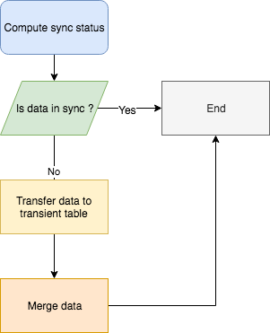
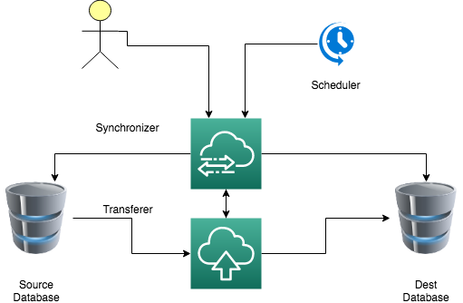
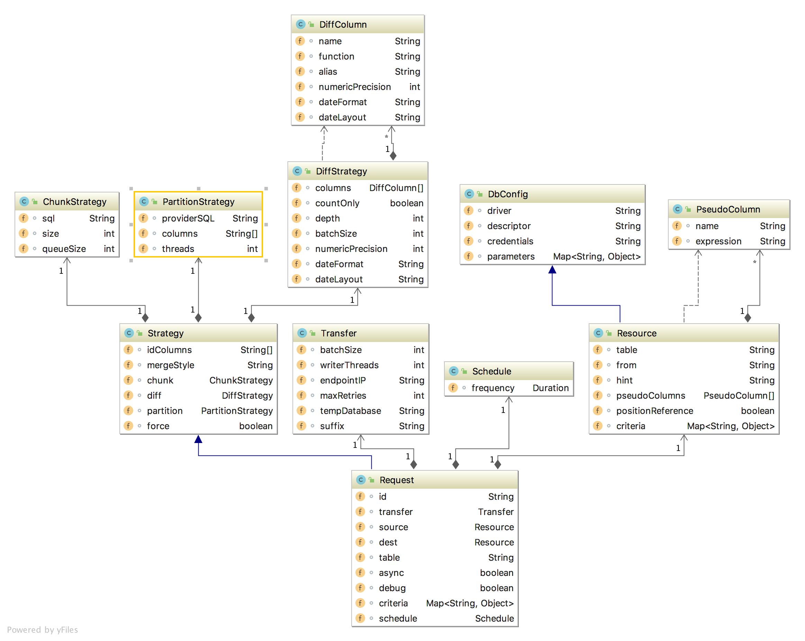
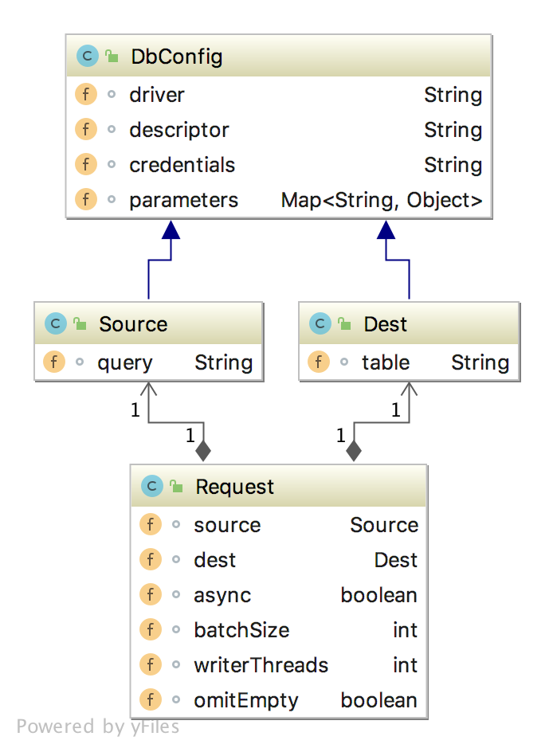
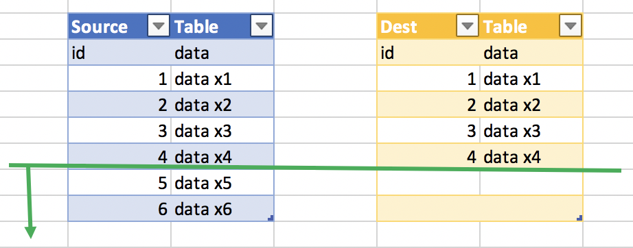
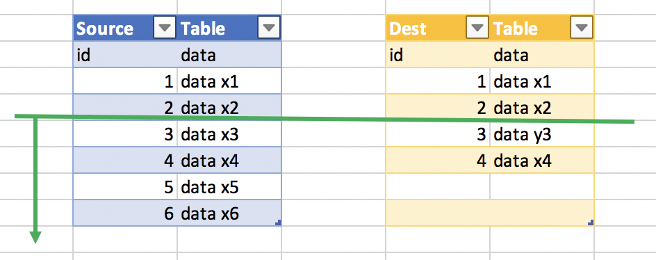
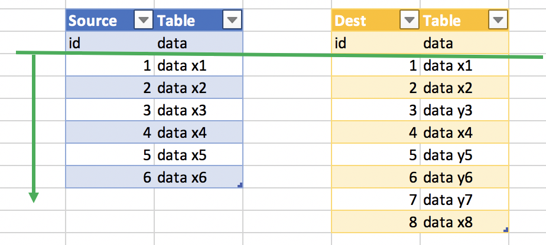

# dbsync - SQL based cross database cost effective synchronization

[](https://goreportcard.com/report/github.com/viant/dbsync)
[](https://godoc.org/github.com/viant/dbsync)

This library is compatible with Go 1.11+


Please refer to [`CHANGELOG.md`](CHANGELOG.md) if you encounter breaking changes.

- [Motivation](#motivation)
- [Introduction](#introduction)
- [Contract](#contract)
- [Usage](#usage)
- [Data comparision strategy](#data-comparision-strategy)
- [Applying custom filters](#applying-custom-filters)
- [Partitioned synchronization](#partitioned-synchronization)
- [Pseudo columns](#pseudo-columns)
- [Chunked synchronization](#chunked-synchronization)
- [Query based synchronization](#query-based-synchronization)
- [Non PK tables synchronization](#non-pk-tables-synchronization)
- [Managing transfer](#managing-transfer)
- [Running end to end test](#running-end-to-end-test)
- [Supported databases](#supported-databases)
- [Deployment](#deployment)
- [Checking data sync quality](#checking-data-sync-quality)
- [GoCover](#gocover)
- [License](#license)
- [Credits and Acknowledgements](#credits-and-acknowledgements)


### Motivation

With cloud echo system, data synchronization between various database and cloud vendor becomes more and more frequent task.
Brute force method can be accomplished simply by coping data from source to destination followed by removal records from dest table that do not exist in source and merging the rest.
While dealing with large dataset or high sync frequency , data sync cost (ingress bandwidth, actual data transfer cost) can not be simply ignored, thus brute force approach may not be the best strategy.
This project provides SQL based cross database vendor data synchronization for small and large(billions+ records) tables/views in a cost effective way.  
This is achieved by both determining the smallest changed dataset and by dividing transferable dataset in the partitioned/chunked segments. Both read and writes can be easily parallelized.

### Introduction



##### 1. Synchronization status

In this step, synchronizer uses aggregation function to compare source and destination table.
In case of data discrepancy, the process narrows down source dataset to the one that has been changed.
When chunks or partition or both are used, on top of narrowing source dataset, only out of sync data segments are transferred to destination database.
Sync process uses transient table for each partition, chunk or partition chunk combination which creates prior transfer based on dest table.
This provides additional sync safety, while it is possible that data transfer may fail half-way through, with this approach only successful data segment is merged with dest table. 

##### 2. Data transfer

Changed dataset is moved from source to transient table in destination database with transfer service.
Transfer service streamlines data copy with parallel writes and compacted collections.
It uses batched inserts or batched load job (BigQuery) to reduce unnecessary round trips.
On top of that large dataset can be divided in to partition or/and smaller transferable chunks, which 
provides additional level of the read paralelization. 

##### 3. Data Merge

During checking synchronization status, sync process determines merge strategy based on the changed dataset
which is one of the following:

- insert - append data to destination table
- merge  - append or update data in destination table
- delete merge - remove data from destination table if it does not exist in transferred transient table, then merge
- delete insert - remove data from destination table if it does not exist in transferred transient table, then append




### Contract

######  Sync service contract



##### Sync service configuration 
* --url URL location with scheduled synchronization
* --urlRefresh scehdule location refresh in ms
* --port service port
* --debug enabled debug
* --statsHistory number of completed sync info stored in memory (/v1/api/history/{ID})

###### Transfer service contract



### Usage

#### Sending sync requests

_JSON format_

```bash
curl -d @request.json -X POST  -H "Content-Type: application/json"  http://127.0.0.1:8081/v1/api/sync
```

[data.json](usage/request.json)
```json
{
    "Table": "events",
	"IDColumns": [
		"id"
	],
    "Source": {
        "Credentials": "mysql-e2e",
        "Descriptor": "[username]:[password]@tcp(127.0.0.1:3306)/[dbname]?parseTime=true",
        "DriverName": "mysql",
        "Parameters": {
            "dbname": "db1"
        }
    },
	"Dest": {
		"Credentials": "mysql-e2e",
		"Descriptor": "[username]:[password]@tcp(127.0.0.1:3306)/[dbname]?parseTime=true",
		"DriverName": "mysql",
		"Parameters": {
			"dbname": "db2"
		}
	},
	"Transfer": {
    	"EndpointIP": "127.0.0.1:8080",
	    "WriterThreads": 2,
    	"BatchSize": 2048
	}
}

```

_YAML format_

```bash
    curl --data-binary @request.yaml -X POST  -H "Content-Type: application/yaml"  http://127.0.0.1:8081/v1/api/sync
```

[request.yaml](usage/request.yaml)
```yaml
table: events
idColumns: 
  - id
source: 
  credentials: mysql-e2e
  descriptor: [username]:[password]@tcp(127.0.0.1:3306)/[dbname]?parseTime=true
  driverName: mysql
  parameters: 
    dbname: db1
dest: 
  credentials: mysql-e2e
  descriptor: [username]:[password]@tcp(127.0.0.1:3306)/[dbname]?parseTime=true
  driverName: mysql
  parameters: 
    dbname: db2
    
transfer: 
  endpointIP: 127.0.0.1:8080
  writerThreads: 2
  batchSize: 2048

```

#### Scheduled sync 

Place scheduled request in url specified with sync service

[scheduled.yaml](usage/scheduled.yaml)
```yaml
table: events
idColumns:
  - id
diff:
  countOnly: true  
source:
  ...
dest:
   ...
transfer:
  ...
schedule:
  frequency:
    value: 1
    unit: hour
```

#### Monitoring sync service URI 

- /v1/api/jobs: list all recently active sync jobs
- /v1/api/scheduled list all scheduled jobs
- /v1/api/job/{ids}: progress info for specified jobs id(s)
- /v1/api/job/history/{ids}: history info for specified jobs id(s)

```bash
    curl http://127.0.0.1:8081//v1/api/jobs
```

#### Monitoring trasfer service URI

- /v1/api/tasks: list all recently active transfer tasks


### Data comparision strategy

Detecting data discrepancy uses aggregate function on all or just specified columns.
Data comparision can be applied on the whole table, virtual partition(s) or a chunk level.

By default all dest table columns are used to identified data discrepancy, 
the following aggregate function rules apply:
 - for any numeric data type SUM aggregate function is used
 - for any time/date data type MAX aggregate function is used
 - for other data type COUNT DISTINCT is used

When **countOnly** option is selected, total rows COUNT is used, this is especially useful when source
table uses data appends only.


In either case for single column ID based table the following aggregates are also added:
 - max ID: MAX(id) 
 - min ID: MIN(id) 
 - total rows count: COUNT(1)
 - unique distinct count: COUNT(distinct ID) 
 - unique not null sum: SUM(CASE WHEN ID IS NULL THEN 1 ELSE 0 END) 

The last three are used to check if data inconsistency, duplication, id constraint violation.


##### Narrowing change dataset process

Narrowing process try to find max ID in destination dataset which is in sync with the source.
Note that this process is only applicable for single numeric ID based table.


######  Insert strategy



In case when source and dest dataset are discrepant and source ID is greater than dest ID, 
synchronizer takes dest max ID, to check if up to that ID both dataset are equal, if so 
it uses INSERT strategy and transfer only source data where source ID is greater then dest max ID.


######  Merge strategy


 
When source ID is greater then dest ID and [insert strategy](#insert-strategy) can not be applied, 
synchronizer would try to reduce/expand dest dataset range where upper bound is limited by 
dest max ID and delta defined as half dataset ID distance (max id +/- delta),
if probed data is in sync, narrowed ID is used and delta is increased by half, otherwise decrease for next try.
Number of iteration in this process is controlled by depth parameter (0 by default).

When narrowed dataset is determined, merge(inser/update) strategy is used, 
and synchronizer transfers only source data where source ID is greater then narrowed ID.

###### Delete/Merge strategy



When source ID is lower than dest ID, or source row count is lower than dest, delete/merge strategy is used.
In case of non-chunked transfer all source dataset is copied to dest transient table, followed by deletion 
of any dest table records which are not be found in transient table, then data is merged.

When chunked-transfer is used only discrepant chunk are transferred, 
thus deletion is reduced to discrepant chunks.


###### Diff Contract settings
- diff.columns: custom columns with aggregate function used to compare source and destination
- diff.countOnly: flag to use only row COUNT comparision
- diff.depth:  specifies number attempts to find max dest ID synchronized with the source
- diff.batchSize: number of partition  (512)
- diff.numericPrecision: default required decimal precision when comparing decimal data (can be also specified on diff.columns level)
- diff.dateFormat: default date format used to compare date/time data type (can be also specified on diff.columns level)
- diff.dateLayout: default date layout used to compare date/time data type (can be also specified on diff.columns level)


##### Custom data comparision

In scenario where each source data mutation also updates specified column(s) i.e UPDATED, it is more effective to just use
column(s) in question instead of all of them. 
Note that, since table is single ID based beside COUNT(1), MAX(ID), MIN(ID) is also used in data comparision.

[custom_diff.yaml](usage/custom_diff.yaml)

```yaml
table: sites
idColumns:
  - id
source:
  ...
dest:
  ...
  
diff:
  depth: 2
  columns:
    - name: UPDATED
      func: MAX
```


### Applying custom filters

Sometimes instead of sync the whole table, one might be interested in getting only table subset sync, in that case you can use criteria

[criteria.yaml](usage/criteria.yaml)
```yaml
table: events
criteria:
  event_type: ' > 4'
diff:
  countOnly: true  
source:
  ...
dest:
  ...
transfer:
  ...
```


### Partitioned synchronization

Partition synchronization uses set of values provided by SQL as filter to divide dataset into a smaller partition bound segments. Partition column values are generated by a sqlProvider. 
Only out of syn partition are synchronized, diff computation could be batched into one SQL for number of partitions which is controlled with batchSize on strategy diff level (512 by default).

While each discrepant partition is synchronized individually, multiple partition can be processed concurrently which 
is controlled with threads strategy  partition level setting (2 by default) 


###### Partition Contract settings

- partition.providerSQL: SQL providing partition values
- columns: partition column or pseudo columns
- threads: number of threads processing partition sync


_Partition based sync example._

[partition.yaml](usage/partition.yaml)
```yaml
table: events
tempDatabase: transfer
idColumns:
  - id

partition:
  threads: 10
  providerSQL:  SELECT DATE(timestamp)::varchar AS date, event_type
                FROM db.events
                WHERE DATE(timestamp) > sysdate - 3
                GROUP BY 1, 2
                ORDER BY 1 DESC, 2 DESC
  columns:
    - date
    - event_type

diff:
  countOnly: true
  batchSize: 1024

source:
  datastore: db
  driverName: odbc
  descriptor: driver=Vertica;Database=[database];ServerName=[server];port=5433;user=[username];password=[password]
  positionReference: true
  pseudoColumns:
    - name: date
      expression: TO_CHAR(t.timestamp, 'YYYY-MM-DD')


dest:
  driverName: bigquery
  positionReference: true
  parameters:
    datasetId: db
  pseudoColumns:
    - name: date
      expression: DATE(t.timestamp)

transfer:
  endpointIP: 10.55.1.181:8080
  writerThreads: 3
  writerCount: 3
  batchSize: 524287

```

### Pseudo columns

Various database vendor provide SQL specific function set like DATE/TIME formatting, or event dialect expression i.e data type casting.   
Pseudo column is SQL expression based column to leverage partition or criteria, defined separately source or destination databases.
Each actual column reference has to use t. alias.


_Pseudo column example_  
```yaml
  pseudoColumns:
    - name: date
      expression: TO_CHAR(t.timestamp, 'YYYY-MM-DD')
    - name: date2
      expression: DATE(t.timestamp)::varchar
```  
  
### Chunked synchronization

Chunk synchronization uses ID based range to divide a dataset into a smaller segments. Each segement is compared and synchronized with destination table.
All non deleteMerge segments transfers are combined into final transient table before merging with destination table. This approach is especially handy with 
database vendors that have insert/load operation limits per table i.e. BigQuery.  


Node that only table with single numeric ID based table can use chunked data sync.


```sql
SELECT min_value, max_value, count_value
  FROM (
    SELECT 
           MIN($id) min_value, 
           MAX($id) AS max_value, 
           COUNT(1) AS count_value
    FROM $table t 
      $whereClause
    ORDER BY $id
  LIMIT $limit 
)
``` 
WHERE:
    - $table: sync table
    - $id: table ID
    - $limit: chunk.size
    - $whereClause is dynamic where clause it looks like (WHERE $id > $max)
    - $where is dynamic clause fragment without WHERE keyword  it looks like ( $id > $max)


###### Custom chunking SQL

For database that do not support LIMIT yuu have provide custom SQL


_Oracle chunk SQL example_
```sql
SELECT
  MIN(ID) AS MIN_VALUE,
  MAX(ID) AS MAX_VALUE,
  COUNT(1) AS COUNT_VALUE
FROM (
      SELECT   /*+ INDEX_ASC(t PK_ID)*/ ID
      FROM events t
      WHERE ROWNUM <= $limit  $where
) t
```

###### Chunk Contract settings
- chunk.size - chunk max size
- chunk.threads - number of threads processing chunk sync 
- chunk.SQL - custom chunking SQL

_Chunk sync example_ 
```yaml
table: events
tempDatabase: transfer
idColumns:
  - id

diff:
  depth: 2
  countOnly: true

source:
  datastore: db
  driverName: odbc
  descriptor: driver=Vertica;Database=[database];ServerName=[server];port=5433;user=[username];password=[password]
  positionReference: true


dest:
  driverName: bigquery
  positionReference: true
  parameters:
    datasetId: db

transfer:
  endpointIP: 127.0.0.1:8080
  writerThreads: 3
  writerCount: 3
  batchSize: 524287

chunk:
  size: 1048576
  queueSize: 10

```

### Query based synchronization

In some cases view or actual SQL can be source for data sync, in that scenario SQL can be used as source.


_Query based sync example_

[query.yaml](usage/query.yaml)
```yaml
table: events
idColumns:
  - id
source:
  drom: SELECT * FROM events WHERE ID > 5
  descriptor: "[username]:[password]@tcp(127.0.0.1:3306)/[dbname]?parseTime=true"
  driverName: mysql
  parameters:
    dbname: db1
dest:
  descriptor: "[username]:[password]@tcp(127.0.0.1:3306)/[dbname]?parseTime=true"
  driverName: mysql
  parameters:
    dbname: db2
transfer:
  EndpointIP: 127.0.0.1:8080
  writerThreads: 1
  tempDatabase: transfer
  batchSize: 2048

```

### Non PK tables synchronization

Sometimes there is need to move data that does not have unique/pk contraint (i.e aggregated data), in that case synchronizer moves all source data to transient table
followed by delete all from dest and insert all from transient table.
Partitioned sync and custom criteria can be used in conjunction with non ID based data synchronization.  


_Non ID based sync example_
[non_id.yaml](usage/non_id.yaml)
```yaml
table: events
diff:
  CountOnly: true
source:
 ...
dest:
  ...
transfer:
  ...
```

### Managing transfer

Transfer process is delegated to the transfer service, the following parameter can be used:

- id: sync job id, dest table name by default
- table: name of source and dest table, otherwise override on source,dest level
- force: flag to brute force data sync: (can be used with NoSQL database type)
- appendOnly: flag to use append new entries
- transfer.batchSize: batch size for insert/load operation
- transfer.writerThreads: number of writing threads
- transfer.endpointID: ip:port of transfer service
- transfer.maxRetries
- transfer.tempDatabase: name of database used for transient tables
- transfer.suffix: transient table suffix fragment 

#### ORDER/GROUP BY position support

Some dataase do not support GROUP/ORDER BY position, in that case actual unaliased expression has to be used
resource.positionReference informs query builder if databae vendor support this option.
 
- source.positionReference flags if source database support GROUP/ORDER BY position
- dest.positionReference flags if dest database support GROUP/ORDER BY position

### Running end to end test


End to end testing provide practical [examples](e2e/regression/use_cases) with how to configure data sync between various database vendor and scenarios

 - TODO add HOWTO


### Supported database

All drivers implementing database/sql should be supported,
in addition some NoSQL database supported by viant/dsc can be used as source with brute-force sync method (force:true)

#### Drivers currently imported
  - BigQuery
  - Oracle
  - MySQL
  - Postgress
  - Vertica 
  - ODBC


### Deployment
1. Standalone services

```bash
export sourcePath=/tmp/build/dbsync 
export GO111MODULE=on
unset GOPATH
export LD_LIBRARY_PATH=${env.HOME}/Downloads/instantclient_12_2
export PKG_CONFIG_PATH=${env.HOME}/Downloads/instantclient_12_2

cd /tmp/build/
git clone https://github.com/viant/dbsync.git

rm $sourcePath/transfer/app/vtransfer
rm $sourcePath/transfer/app/nohup.out
cd $sourcePath/transfer/app
go build -o dbtransfer


rm $sourcePath/sync/app/nohup.out
rm $sourcePath/sync/app/vsync
cd $sourcePath/sync/app
rm -rf $sourcePath/sync/app/cron
go build -o dbsync
```

2. Bulding docker images

This project use [endly workflow](docker/build.yaml)  to build docker size optimized service images

```bash
cd /tmp/build/
git clone https://github.com/viant/dbsync.git
cd dbsync/docker
endly -r=build
``` 

3. Docker compose

[docker-compose.yaml](docker/compose/docker-compose.yaml)

4. Cloud run - TODO provide examples

5. Kubernetes - TODO provide examples


##### Custom build

If database/sql driver is not listed in the in the currently imported list, you can add import for additional drivers and customize a service build. 

Add default import to the following service entry points:
  
- [sync service](sync/app/app.go)  
- [trasfer service](transfer/app/app.go)


### Checking data sync quality

In order to compare dataset between source and dest database, you can use endly runner with compare workflow.
It uses [dsunit](http://github.com/viant/dsunit/) and  [asserly](http://github.com/viant/assertly/) testing framework for comprehensive data validation. 


```bash
endly -r=compare
```
[compare.yaml](usage/compare.yaml)
```yaml
init:
  date: '2019-01-01'
pipeline:
  register:
    
    verticadb:
      action: dsunit:register
      datastore: db1
      config:
        driverName: odbc
        descriptor: driver=Vertica;Database=[database];ServerName=[server];port=5433;user=[username];password=[password]
    
    bigquerydb:
      action: dsunit:register
      datastore: db2
      config:
        driverName: bigquery
        parameters:
          datasetId: db

  compare:
    action: dsunit:compare
    maxRowDiscrepancy: 1000000
    directives:
      "@indexBy@": date
      "@numericPrecisionPoint@": 1
      "@coalesceWithZero@": true
      "@caseSensitive@": false
      "@timeFormat@date": 'yyyy-MM-dd'
    omitEmpty: true
    source1:
      datastore: db1
      SQL: SELECT
              DATE(timestamp) AS date,
              COUNT(*) AS cnt,
              SUM(revenue) AS revenue,
              SUM(payment) AS payment,
              SUM(charges) AS charges 
           FROM  db.events
           WHERE DATE(timestamp) >= '$date'
           GROUP BY 1
           ORDER  BY 1
    source2:
      datastore: db2
      SQL: SELECT
              DATE(timestamp) AS date,
              COUNT(*) AS cnt,
              SUM(revenue) AS revenue,
              SUM(payment) AS payment,
              SUM(charges) AS charges
            FROM  db.events
            WHERE DATE(timestamp) >= '$date'
            GROUP BY 1
            ORDER  BY 1
```


## GoCover

[](https://gocover.io/github.com/viant/dbsync)


## License

The source code is made available under the terms of the Apache License, Version 2, as stated in the file `LICENSE`.

Individual files may be made available under their own specific license,
all compatible with Apache License, Version 2. Please see individual files for details.


## Credits and Acknowledgements

**Library Author:** Adrian Witas

**Contributors:** 